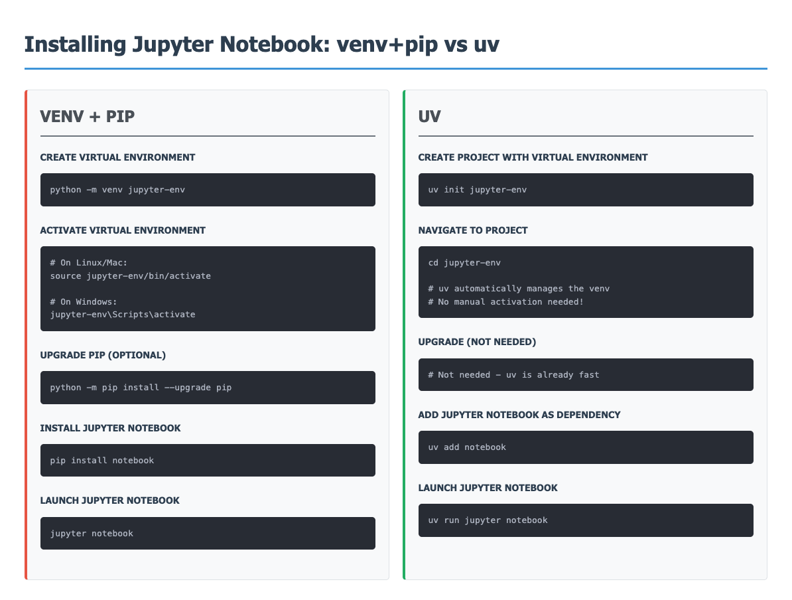
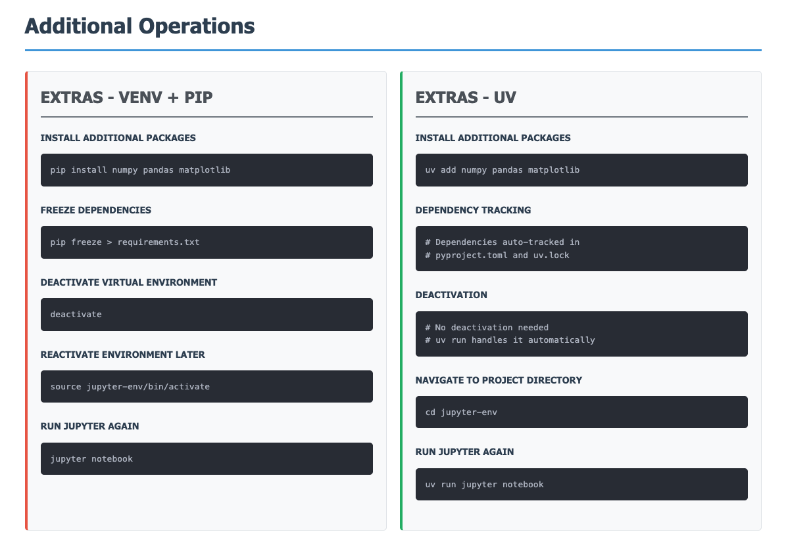
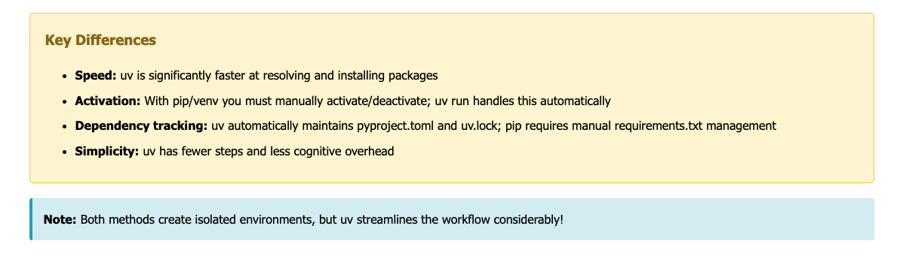

# Jupyter Notebook

## Install Jupyter Notebook Package





### uv - Jupyter Notebook for Python

```bash
# Check if Python is installed on your system
$ python --version

# If an old version of python is installed, update python to the latest version
$ brew update
$ brew upgrade python

# Install uv globally (macOS)
$ brew install uv

# Create a project directory and navigate inside it
$ mkdir python-notebook
$ cd python-notebook

# Create a project with uv
$ uv init

# Add Jupyter Notebook as dependency
$ uv add notebook

# (Optional) Launch and check if jupyter notebook is installed correctly
$ uv run jupyter notebook

# Open up the project in VSCode
$ code .

# Install the following VSCode extensions
# 1. Black Formatter (Optional)
# 2. Jupyter
# 3. Pylance
# 4. Python
# 5. Python Debugger
# 6. Python Environments

# Once asked to select a Kernel
# Choose: 'Python Environments...' -> python-notebook (Python 3.14.2) .venv/bin/python
```

### uv - Jupyter Notebook for Java

```bash
# Check if Java is installed on your system
$ java --version
$ javac --version

# If Java is not installed, install the latest LTS version of Java (Java 11+):
$ brew update
$ brew install openjdk@21

# Install uv globally (macOS)
$ brew install uv

# Create a project directory and navigate inside it
$ mkdir java-notebook
$ cd java-notebook

# Create a project with uv
$ uv init

# Add Jupyter Notebook as dependency
$ uv add notebook

# Install IJava using pre-built installer
$ curl -L -o ijava.zip https://github.com/SpencerPark/IJava/releases/download/v1.3.0/IJava-1.3.0.zip

# Unzip it and navigate to the extracted directory
$ unzip ijava.zip -d ijava
$ cd ijava

# Run the installer with the –user flag to install the kernel
# NOTE: Installs the kernel inside ~/Library/Jupyter/kernels/java
$ uv run python install.py --user

# Verify the kernel installation
$ uv run jupyter kernelspec list

# (Optional) Launch and check if jupyter notebook is installed correctly
$ uv run jupyter notebook

# Open up the project in VSCode
$ code .

# Install the following VSCode extensions
# 1. Prettier (Optional)
# 2. Jupyter
# 3. Java (Recommended) (by Oracle Corporation)
# 4. Extension Pack for Java (Optional if #3 is installed)

# Once asked to select a Kernel
# Choose: 'Jupyter Kernel...' -> Java /java
```

### uv - Jupyter Notebook for TypeScript

```bash
# Check if Node.js is installed on your system (preferably the LTS version)
$ node -v
$ npm -v

# If Node.js in not installed then install the latest LTS version of Node.js via nvm
$ brew install nvm
$ nvm list
$ nvm install 20

# Install uv globally (macOS)
$ brew install uv

# Create a project directory and navigate inside it
$ mkdir typescript-notebook
$ cd typescript-notebook

# Create a project with uv
$ uv init

# Add Jupyter Notebook as dependency
$ uv add notebook

# Install Deno
$ brew install deno

# Install the Deno Jupyter kernel
# NOTE: Installs the kernel inside ~/Library/Jupyter/kernels/deno
$ deno jupyter --install

# Verify the kernel installation
$ uv run jupyter kernelspec list

# (Optional) Launch and check if jupyter notebook is installed correctly
$ uv run jupyter notebook

# Open up the project in VSCode
$ code .

# Install the following VSCode extensions
# 1. Prettier (Optional)
# 2. Jupyter
# 3. ESLint
# 4. Babel JavaScript

# Once asked to select a Kernel
# Choose: 'Jupyter Kernel...' -> Deno /opt/homebrew/bin/deno
```

### uv - Jupyter Notebook for JavaScript

```bash
# Even though IJavaScript is the stable JavaScript kernel based on Node.js for Jupyter
# But we are not recommending it because of complexity of setup + it does not support TypeScript

# Check if Node.js is installed on your system (preferably the LTS version)
$ node -v
$ npm -v

# Date: December 10, 2025
# Check the installed Node.js version, if the Node.js version is greater than 24 then install Node.js 20 (LTS) via nvm
# Since the latest Node.js 24 (LTS) version is not supported by ijavascript package
# Also do the same if your don't have any version of Node.js installed on your system
$ brew install nvm
$ nvm list
$ nvm install 20

# Install uv globally (macOS)
$ brew install uv

# Create a project directory and navigate inside it
$ mkdir javascript-notebook
$ cd javascript-notebook

# Create a project with uv
$ uv init

# Add Jupyter Notebook as dependency
$ uv add notebook

# Install ZeroMQ and pkg-config (Required dependency for IJavascript package)
$ brew install zeromq pkg-config

# Install IJavascript globally
$ npm install -g ijavascript

# Install the kernel locally
# NOTE: Installs the kernel inside ~/Library/Jupyter/kernels/javascript
$ uv run ijsinstall --install=local

# Verify the kernel installation
$ uv run jupyter kernelspec list

# Update the correct executable in the kernel.json
$ vim ~/Library/Jupyter/kernels/javascript/kernel.json

# Original content of kernel.json
{
  "argv": [
    "ijskernel",
    "--hide-undefined",
    "{connection_file}",
    "--protocol=5.1"
  ],
  "display_name": "JavaScript (Node.js)",
  "language": "javascript"
}

# Updated content of kernel.json
{
  "argv": [
    "/Users/mmt9881/.nvm/versions/node/v20.19.6/bin/node",
    "/Users/mmt9881/.nvm/versions/node/v20.19.6/bin/ijskernel",
    "--hide-undefined",
    "{connection_file}",
    "--protocol=5.1"
  ],
  "display_name": "JavaScript (Node.js)",
  "language": "javascript"
}

# (Optional) Launch and check if jupyter notebook is installed correctly
$ uv run jupyter notebook

# Open up the project in VSCode
$ code .

# Install the following VSCode extensions
# 1. Prettier (Optional)
# 2. Jupyter
# 3. ESLint
# 4. Babel JavaScript

# Once asked to select a Kernel
# Choose: 'Jupyter Kernel...' -> JavaScript (Node.js) ~/.nvm/versions/node/v20.19.6/bin/node
```

## Jupyter Packages Comparison

| Feature                          | `uv add jupyter`                                            | `uv add notebook`             | `uv add jupyterlab`                   |
| -------------------------------- | ----------------------------------------------------------- | ----------------------------- | ------------------------------------- |
| **What it installs**             | Meta-package (includes both notebook + console + qtconsole) | Classic Jupyter Notebook only | Modern JupyterLab interface only      |
| **Interface**                    | Classic Notebook UI                                         | Classic Notebook UI           | Modern tabbed IDE-like UI             |
| **File browser**                 | Basic                                                       | Basic                         | Advanced with file manager            |
| **Extensions**                   | Limited                                                     | Limited                       | Rich extension ecosystem              |
| **Tabs/Multiple notebooks**      | No (one tab per notebook)                                   | No (one tab per notebook)     | Yes (multiple tabs in one window)     |
| **Terminal**                     | No                                                          | No                            | Yes (integrated terminal)             |
| **Text editor**                  | No                                                          | No                            | Yes (built-in code editor)            |
| **Themes**                       | Basic                                                       | Basic                         | Customizable themes                   |
| **Layout**                       | Fixed                                                       | Fixed                         | Flexible (drag & drop panes)          |
| **Package size**                 | ~100MB (includes extras)                                    | ~50MB                         | ~80MB                                 |
| **Best for**                     | Legacy projects needing all Jupyter tools                   | Simple notebook-only needs    | Modern development & data science     |
| **Command to run**               | `uv run jupyter notebook`                                   | `uv run jupyter notebook`     | `uv run jupyter lab`                  |
| **Modern features**              | No                                                          | No                            | Yes (debugger, Git integration, etc.) |
| **Learning curve**               | Easy                                                        | Easy                          | Moderate                              |
| **Performance**                  | Standard                                                    | Standard                      | Faster & more responsive              |
| **Recommended for new projects** | No (bloated)                                                | Only if you prefer classic UI | Yes (modern standard)                 |

## Recommendations

### Choose `jupyterlab` if

- ✅ Starting a new project
- ✅ Want modern IDE-like features
- ✅ Need multiple notebooks/files open simultaneously
- ✅ Want built-in terminal and text editor
- ✅ Plan to use extensions

### Choose `notebook` if

- ✅ Prefer the classic simple interface
- ✅ Working on legacy projects
- ✅ Have simpler notebook needs
- ✅ Want minimal package size

### Choose `jupyter` if

- ⚠️ Need the full Jupyter stack (notebook + console + qtconsole)
- ⚠️ Working with very old projects
- ❌ Generally not recommended for new projects (unnecessary bloat)

## Installation Commands

```bash
# Recommended: JupyterLab (modern)
# Add as developer dependency: uv add --dev jupyterlab
uv add jupyterlab
uv run jupyter lab

# Classic Notebook interface
uv add notebook
uv run jupyter notebook

# Full Jupyter package (not recommended)
uv add jupyter
uv run jupyter notebook  # or jupyter lab if installed
```

## Visual Comparison

### Classic Notebook (`notebook`)

- Single notebook per browser tab
- Simple toolbar at top
- Basic file browser
- Traditional look and feel

### JupyterLab (`jupyterlab`)

- Multiple notebooks in tabs
- Collapsible sidebar
- File browser + running kernels panel
- Integrated terminal
- Extension manager
- Modern VS Code-like interface
- Drag-and-drop layout customization

## Modes in Jupyter Notebook

Jupyter notebooks have two modes:

- **Command Mode** (blue cell border) - Press `Esc` to enter
- **Edit Mode** (green cell border) - Press `Enter` to enter

---

## Command Mode Shortcuts (Press `Esc` first)

### Navigation

| Shortcut                  | Action                 |
| ------------------------- | ---------------------- |
| `↑` / `K`                 | Select cell above      |
| `↓` / `J`                 | Select cell below      |
| `Cmd + ↑`                 | Go to first cell       |
| `Cmd + ↓`                 | Go to last cell        |
| `Shift + ↑` / `Shift + K` | Extend selection above |
| `Shift + ↓` / `Shift + J` | Extend selection below |

### Cell Operations

| Shortcut               | Action                  |
| ---------------------- | ----------------------- |
| `A`                    | Insert cell above       |
| `B`                    | Insert cell below       |
| `X`                    | Cut selected cell(s)    |
| `C`                    | Copy selected cell(s)   |
| `V`                    | Paste cell(s) below     |
| `Shift + V`            | Paste cell(s) above     |
| `D, D` (press D twice) | Delete selected cell(s) |
| `Z`                    | Undo cell deletion      |
| `Shift + M`            | Merge selected cells    |
| `Cmd + Shift + -`      | Split cell at cursor    |

### Cell Type Conversion

| Shortcut | Action                                               |
| -------- | ---------------------------------------------------- |
| `Y`      | Change cell to Code                                  |
| `M`      | Change cell to Markdown                              |
| `R`      | Change cell to Raw                                   |
| `1-6`    | Change to Heading 1-6 (deprecated, use Markdown `#`) |

### Running Cells

| Shortcut         | Action                    |
| ---------------- | ------------------------- |
| `Ctrl + Enter`   | Run selected cell(s)      |
| `Shift + Enter`  | Run cell and select below |
| `Option + Enter` | Run cell and insert below |
| `Cmd + S`        | Save notebook             |

### View & Interface

| Shortcut        | Action                           |
| --------------- | -------------------------------- |
| `L`             | Toggle line numbers              |
| `O`             | Toggle cell output               |
| `Shift + O`     | Toggle output scrolling          |
| `Space`         | Scroll notebook down             |
| `Shift + Space` | Scroll notebook up               |
| `Shift + L`     | Toggle line numbers in all cells |

### Kernel Operations

| Shortcut               | Action           |
| ---------------------- | ---------------- |
| `I, I` (press I twice) | Interrupt kernel |
| `0, 0` (press 0 twice) | Restart kernel   |

### Selection & Search

| Shortcut                   | Action                             |
| -------------------------- | ---------------------------------- |
| `Shift + J` or `Shift + ↓` | Select next cell                   |
| `Shift + K` or `Shift + ↑` | Select previous cell               |
| `Cmd + F`                  | Find and replace                   |
| `F`                        | Find and replace (in Command mode) |

### Help & Other

| Shortcut | Action                       |
| -------- | ---------------------------- |
| `H`      | Show keyboard shortcuts help |
| `P`      | Open command palette         |
| `Esc`    | Close command palette        |
| `Q`      | Close window                 |

---

## Edit Mode Shortcuts (Press `Enter` first)

### Basic Editing

| Shortcut          | Action                                 |
| ----------------- | -------------------------------------- |
| `Tab`             | Code completion or indent              |
| `Shift + Tab`     | Tooltip (function signature/docstring) |
| `Cmd + ]`         | Indent                                 |
| `Cmd + [`         | Dedent                                 |
| `Cmd + A`         | Select all                             |
| `Cmd + Z`         | Undo                                   |
| `Cmd + Shift + Z` | Redo                                   |

### Code Manipulation

| Shortcut                             | Action             |
| ------------------------------------ | ------------------ |
| `Cmd + /`                            | Toggle comment     |
| `Cmd + D`                            | Delete whole line  |
| `Cmd + ←` / `Fn + ←`                 | Go to cell start   |
| `Cmd + →` / `Fn + →`                 | Go to cell end     |
| `Option + ←`                         | Go one word left   |
| `Option + →`                         | Go one word right  |
| `Option + Backspace`                 | Delete word before |
| `Option + Delete` / `Fn + Backspace` | Delete word after  |

### Running Code

| Shortcut          | Action                    |
| ----------------- | ------------------------- |
| `Ctrl + Enter`    | Run cell                  |
| `Shift + Enter`   | Run cell and select below |
| `Option + Enter`  | Run cell and insert below |
| `Cmd + Shift + -` | Split cell at cursor      |

### Switching Modes

| Shortcut  | Action             |
| --------- | ------------------ |
| `Esc`     | Enter Command mode |
| `Cmd + M` | Enter Command mode |

---

## JupyterLab-Specific Shortcuts

### Additional JupyterLab Features

| Shortcut          | Action               |
| ----------------- | -------------------- |
| `Cmd + B`         | Toggle left sidebar  |
| `Cmd + Shift + D` | Duplicate line       |
| `Cmd + Shift + C` | Open command palette |
| `Cmd + Shift + L` | Toggle line numbers  |
| `Cmd + Shift + [` | Collapse all cells   |
| `Cmd + Shift + ]` | Expand all cells     |
| `Cmd + Shift + P` | Show all commands    |

### Tab Management (JupyterLab)

| Shortcut          | Action              |
| ----------------- | ------------------- |
| `Cmd + Shift + [` | Switch to left tab  |
| `Cmd + Shift + ]` | Switch to right tab |
| `Cmd + W`         | Close current tab   |

---

## Magic Commands (Type in cell)

### Timing & Profiling

| Command    | Action                                        |
| ---------- | --------------------------------------------- |
| `%time`    | Time execution of a single statement          |
| `%timeit`  | Time repeated execution of a single statement |
| `%%time`   | Time execution of entire cell                 |
| `%%timeit` | Time repeated execution of entire cell        |
| `%prun`    | Profile code with cProfile                    |

### Environment & Variables

| Command  | Action                                 |
| -------- | -------------------------------------- |
| `%who`   | List all variables                     |
| `%whos`  | List all variables with details        |
| `%reset` | Reset namespace (delete all variables) |
| `%pwd`   | Print working directory                |
| `%cd`    | Change directory                       |
| `%ls`    | List files in directory                |

### Code Execution

| Command                | Action                        |
| ---------------------- | ----------------------------- |
| `%run script.py`       | Run Python script             |
| `%load script.py`      | Load code from file into cell |
| `%matplotlib inline`   | Display plots inline          |
| `%matplotlib notebook` | Interactive plots             |
| `%%writefile file.py`  | Write cell contents to file   |

### Debugging

| Command  | Action                          |
| -------- | ------------------------------- |
| `%debug` | Activate debugger               |
| `%pdb`   | Automatic debugger on exception |

### System Commands

| Command                | Action                              |
| ---------------------- | ----------------------------------- |
| `!pip install package` | Run shell command (install package) |
| `!ls`                  | Run shell command (list files)      |
| `!!python --version`   | Capture shell command output        |

### Other Useful Magic

| Command                    | Action                     |
| -------------------------- | -------------------------- |
| `%lsmagic`                 | List all magic commands    |
| `%quickref`                | Quick reference            |
| `%history`                 | Show command history       |
| `%notebook filename.ipynb` | Export history to notebook |

---

## Markdown Shortcuts (in Markdown cells)

### Headers

```markdown
# Heading 1

## Heading 2

### Heading 3

#### Heading 4

##### Heading 5

###### Heading 6
```

### Text Formatting

```markdown
- _italic_
- **bold**
- **_bold italic_**
- ~~strikethrough~~
- `inline code`
```

### Lists

```markdown
- Bullet point
  - Nested bullet

* Alternative bullet

1. Numbered list
2. Second item
   1. Nested numbered
```

### Links & Images

```markdown
[Link text](https://example.com) 
```

### Code Blocks

````markdown
```python
def hello():
    print("Hello World")
```
````

### Math (LaTeX)

```markdown
Inline math: $E = mc^2$ Display math: $$\int_0^\infty e^{-x^2} dx$$
```

---

## Pro Tips

### Quick Tips

- **Double-click** any cell in Command mode to enter Edit mode
- **Run all cells**: Go to `Cell → Run All` in menu
- **Clear all outputs**: `Cell → All Output → Clear`
- **Restart kernel and run all**: `Kernel → Restart & Run All`
- Press `Shift + Tab` multiple times for expanded documentation

### Productivity Hacks

- Use `??function_name` to see source code
- Use `!` prefix to run shell commands: `!pip list`
- Use `%load_ext autoreload` and `%autoreload 2` for automatic module reloading
- Use `Cmd + Shift + P` for command palette (JupyterLab)

### Common Workflows

```python
# Quick timing
%timeit sum(range(1000))

# Display all outputs in a cell (not just last)
from IPython.core.interactiveshell import InteractiveShell
InteractiveShell.ast_node_interactivity = "all"

# Better display for pandas
import pandas as pd
pd.set_option('display.max_columns', None)
pd.set_option('display.max_rows', 100)

# Suppress warnings
import warnings
warnings.filterwarnings('ignore')
```

---

## macOS-Specific Key Notes

**Key Mappings:**

- `Cmd` = Command key (⌘)
- `Option` = Alt/Option key (⌥)
- `Ctrl` = Control key (⌃)
- `Shift` = Shift key (⇧)
- `Fn` = Function key

**Special macOS Navigation:**

- `Fn + ←` = Home
- `Fn + →` = End
- `Fn + ↑` = Page Up
- `Fn + ↓` = Page Down
- `Fn + Backspace` = Delete (forward delete)

---

## Customizing Shortcuts

In JupyterLab:

1. Go to `Settings → Advanced Settings Editor`
2. Select `Keyboard Shortcuts`
3. Add custom shortcuts in the User Preferences panel

In Classic Notebook:

1. Go to `Help → Edit Keyboard Shortcuts`
2. Customize as needed

---

## Essential Shortcuts Summary (Most Used)

| Action             | Command Mode      | Edit Mode         |
| ------------------ | ----------------- | ----------------- |
| Run cell           | `Ctrl + Enter`    | `Ctrl + Enter`    |
| Run and advance    | `Shift + Enter`   | `Shift + Enter`   |
| Insert cell above  | `A`               | -                 |
| Insert cell below  | `B`               | -                 |
| Select cell above  | `↑` / `K`         | -                 |
| Select cell below  | `↓` / `J`         | -                 |
| Delete cell        | `D, D`            | -                 |
| Switch to Markdown | `M`               | -                 |
| Switch to Code     | `Y`               | -                 |
| Enter Edit mode    | `Enter`           | -                 |
| Enter Command mode | -                 | `Esc`             |
| Code completion    | -                 | `Tab`             |
| Show docs          | -                 | `Shift + Tab`     |
| Save notebook      | `Ctrl + S`        | `Ctrl + S`        |
| Comment/Uncomment  | -                 | `Cmd + /`         |
| Toggle sidebar     | `Cmd + B`         | `Cmd + B`         |
| Command palette    | `Cmd + Shift + P` | `Cmd + Shift + P` |

**Master these shortcuts to 10x your Jupyter productivity!** 🚀
